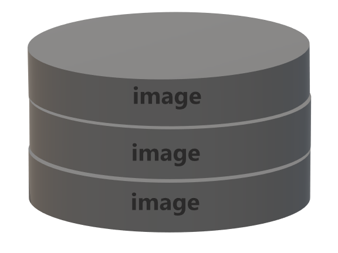

# 데이터 베이스(DOCKER)
## 등장 배경
서버는 사실 하나의 컴퓨터와 같다. 서비스를 담는 서버는<br>하나의 컴퓨터로 생각할 수 있다. 하지만 우리가 평소에 코딩을 하면서<br>썼던 변수들은 모두 메모리로서, 한 마디로 주기억장치이다.<br>하지만 커뮤니티 하나만하더라도 용량이 1TeraByte를 넘어가는데<br>우리가 쓰는 컴퓨터만 하더라도 램이 32GB ~ 16GB 사이가 보통이다.<br>때문에 쓰는 것이 데이터 베이스이다.

---

## 개념
데이터베이스는 일반적으로 컴퓨터 시스템에 전자적으로 저장되는<br>구조화된 정보 또는 데이터의 조직화된 모음입니다.<br>메모리와 달리 영속성을 가지고 대용량성을 가진것.

여기서 구조화된 정보들을 이미지(image)라고 부른다.

##### (데이터 베이스의 구조 그림)



---

## 종류
우리가 주로 사용하는 DB의 종류로는 MYSQL<br>해외에서 많이 사용하는 DB는 PostSQL<br>기업체에서 많이 쓰는 것은 Oracle이라는 DB이다.<br>위 DB는 모두 <span style="color:yellow">관계형데이터베이스(RelationDataBase)</span>이다. 

---

백 엔드는 보통 데이터 베이스에서 아래 CRUD 4가지 과정의 일을 처리한다.
## Create, Read, Update, Delete 
+ Create : 생성 
+ Read : 읽기
+ Update : 수정
+ Delete : 삭제

위 4가지 과정을 프로세싱 하기 위해 쓰는 언어가 SQL이다.

---

Structured Query Language : SQL은 데이터를 쿼리, 조작 및 정의하고<br>액세스 제어를 제공하기 위해 거의 모든 관계형 데이터베이스에서<br>사용되는 프로그래밍 언어.

SQL또한 3가지 갈래로 나뉜다.
+ DDL : Data Definition Language로 데이터 정의어이다.
+ DML : Data Manipulation Language로서 데이터를 조작하는 언어<br>(백 엔드가 주로 사용하는 언어)
+ DCL : Data Control Language로 데이터 제어어이다.

---

## DML
그중 우리가 주로 사용할 DML에 대해 알아보자.<br>DML은 앞서말한 CRUD과정에 해당하는 명령어가 따로 있다.
+ INSERT -> Create
+ SELECT -> Read
+ UPDATE -> Update
+ DELETE -> Delete

위 와 같이 insert, select, update, delete 4가지 명령어가 있다.

---

명령어를 배우기 전에 docker 실행을 해야 명령어를 사용할 수 있기 때문에<br>docker를 실행 시켜보자. 먼저 cmd창을 킨다.<br>그 다음 아래 명령어로  MySQL Docker 이미지를 다운로드한다.
```
docker pull mysql   
```
위와 같이 다운로드 하게 되면 자동으로 최신버전으로 다운받게 된다.<br>따라서 버전을 지정해 주고 싶으면 아래 명령어를 사용한다.
```
docker pull mysql:버전
```
이미지를 다 다운받았으면 생성 및 실행을 해보자
```
docker run --사용자가 사용할 이름 mysql-container -e MYSQL_ROOT_PASSWORD=사용자가 사용할 비번 -d -p 3306:3306 mysql:latest
```
다음은 컨테이나 시작과 중지하는 법이다. 
+ 시작 명령어
```
docker start mysql-container
```
+ 중지 명령어
```
docker stop mysql-container
```
+ 재시작 명령어
```
docker restart mysql-container
```

---

그 다음은 컨테이너에 접속하는 명령어이다.
```
docker exec -it mysql-container bash
```
를쳐주면 아래 상태가 된다.
```
docker exec -it mysql-container bash
root@dc557b92f573:
```
다음과 같이 쳐준다.
```
docker exec -it mysql-container bash
root@dc557b92f573:/# mysql -u root -p
```
그럼 또 다음과 같은 상태가 된다.
```
docker exec -it mysql-container bash
root@dc557b92f573:/# mysql -u root -p
Enter password:
```
이때 생성 및 실행 단계에서 설정했던 비밀번호를 쳐주면 된다.<br>그럼 다음과 같이 준비가 완료된다.
```
docker exec -it mysql-container bash
root@dc557b92f573:/# mysql -u root -p
Enter password:
Welcome to the MySQL monitor.  Commands end with ; or \g.
Your MySQL connection id is 9
Server version: 8.0.22 MySQL Community Server - GPL

Copyright (c) 2000, 2020, Oracle and/or its affiliates. All rights reserved.

Oracle is a registered trademark of Oracle Corporation and/or its
affiliates. Other names may be trademarks of their respective
owners.

Type 'help;' or '\h' for help. Type '\c' to clear the current input statement.
```

---

## INSERT 명령어
```
INSERT INTO 테이블 (컬럼A, 컬럼B) VALUES(컬럼A에 넣을 데이터, 컬럼B에 넣을 데이터);
```
여기서 <span style="color:yellow">컬럼(column)</span>이란?<br>테이블에 각 열을 말한다. 같은 의미로는 속성(attribute)이 있다.

여기서 한가지 의문점이 또 생긴다. 그렇다면 <span style="color:yellow">테이블</span>이란 또 무엇일까?<br>테이블에 구조에 대해 알아보자. 사람A와 B가 있다고 가정을 했을때<br>다음과 같은 정보를 DB에 담게된다.


이때 행 즉  <span style="color:orange">가로축</span>을  <span style="color:orange">튜플</span>이라 부르고,  <span style="color:#34FF56">세로축</span>을  <span style="color:#34FF56">속성이</span>라 부른다.<br>즉 특정 객체의 인스턴스값의 모임이다. ex):A에 대한 인스턴스 = A, 남자, 17<br>속성은 성별이나 나이등 인스턴스값만의 모임이다. ex)성별의 도메인 = 남자, 여자

.png)

##### (튜플 = row)

---

## SELECT 명령어
select는 CRUD중 read에 해당하는 명령어로 
```
SELECCT 추출할컬럼 FROM 테이블 WHERE 조건문
```
의 형태로 구성되어 있다. 여기서 조건문은 어떤것을 얘기하냐면 DB에 저장할때<br>보통 튜플 하나당 아이디(ID) 하나가 할당 되어있는데 (id >= 90)라는 조건문을 쓰면<br>해당테이블에 90보다 큰 아이디값을 가진 컬럼을 추출한다.

---

## UPDATE 명령어
update는 컬럼을 수정하는 명령문이다. 
```
UPDATE 테이블 SET 컬럼A='컬럼A에 수정할 데이터' WHERE 조건식
```
으로 구성되어있다. 조건식에 참이되는 모든 컬럼A를 ''안에 들어간 값으로 바꾼다.

---

## DELETE 명령어
delete는 특정 데이터나 아니면 테이블에 있는 데이터를 삭제할 수 있다.
```
DELETE FROM 테이블 WHERE 조건문
```
이렇게 쓰면 조건문에 참이되는 테이블의 데이터는 삭제된다.

※여기서 주의 할 점※<br>조건문을 쓰지 않으면<span style="color:red">테이블의 모든 데이터가 삭제된다</span>.

---

우린 지금까지 table란걸 계속 적었는데 우린 아직 table을 만드는 법을 모른다.<br>따라서 테이블을 만드는 명령어에 대해 알아보자. 

## 테이블 생성
먼저 쿼리는 아래 구조로 이루어져 있다.
```
CREATE TABLE `테이블이름` {
    `컬럼명1` DATATYPE ,
    `컬럼명2` DATATYPE ,
    `컬럼명3` DATATYPE 
};
```
주의할 점이 있는데
1. 테이블을 생성할 때 대/소문자를 구분하지 않는다.
2. 문자 데이터 유형은 반드시 가질 수 있는 최대 길이를 표시해야 한다.
3. SQL은 자료형이 따로있으니 참고 바람(나중에 정리해서 올릴예정)
###### (특히 세미 콜론 찍는거 잊지말자)

--- 