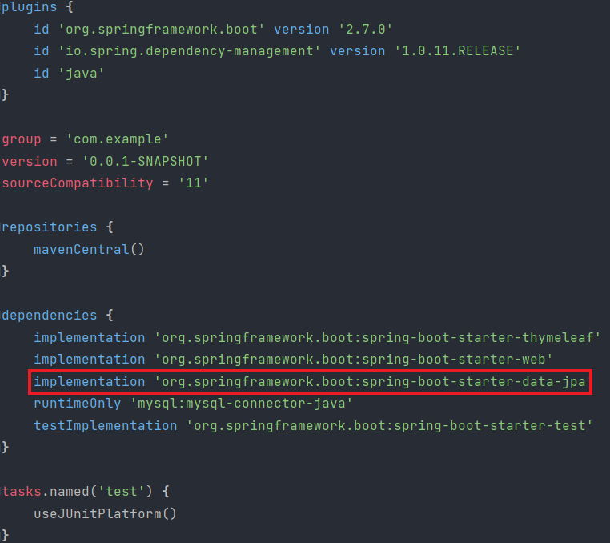

# SpringBoot-DB연동
springboot와 데이터 베이스를 연동하는 방법을 알아보자.<br>먼저 스프링 부트 프로젝트를 설정할 때 다음과 같은 드라이버를 추가해준다.


그리고 프로젝트를 생성해준다.


1. .properties타입을 yml로 바꾸어준다.<br>후에 다음과 같이 의존성을 추가해준다.

```
spring:
  datasource:
    driver-class-name: com.mysql.cj.jdbc.Driver
    url: jdbc:mysql://localhost:3306/DB이름
    password: 설정했던 비밀번호
    username: root
  jpa:
    show-sql: true
    hibernate:
      ddl-auto: none
```
2. build.gradle파일에 다음과 같이 라이브러리를 다운 받아준다.



3. 엔티티 패키지 추가(객체와는 다른 의미)

.png)

4. 엔티티 패키지 아래에 클래스 생성


5. <span style="color:yellow">@Entity</span> 어노테이션 추가

.png)

6. <span style="color:yellow">@Table</span> 어노테이션 추가 및 테이블 지정

.png)

7. 컬럼에 맞춰 변수 생성

.png)

8.  databases패키지 아래에 SQL폴더 생성 및  sql파일 생성


9. 데이터 소스 구성 클릭

.png)

10. +버튼 클릭


11. MySQL선택

.png)

12. 사용자란에 root입력, 비밀번호란에 설정한 비번입력,<br>데이터베이스란에 데이터 베이스 이름 입력

.png)

확인 후 연동 끝