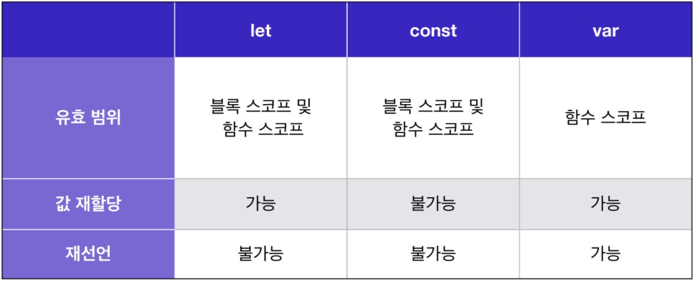
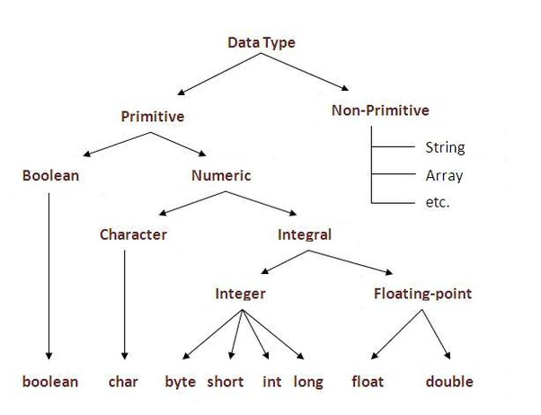
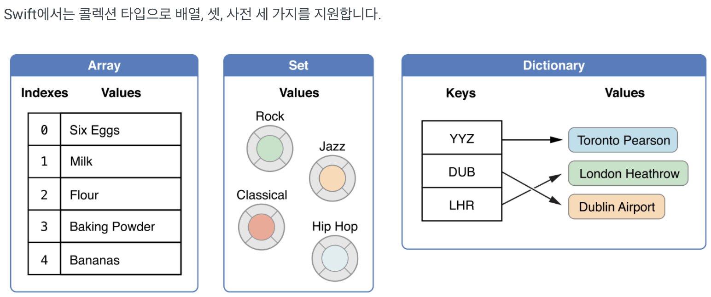
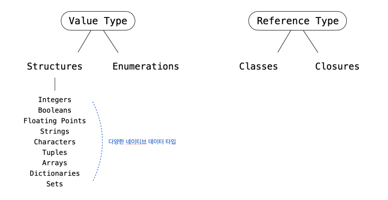

# Swift 자료형



<br>

## 상수와 변수
> **var** = kotlin의 var (가변, 변수)
**let** = kotlin의 val (불변, 상수)
>

<br><br>


# 데이터 타입




<br>

## 기본 데이터 타입

<br>

### Boolean

<aside>
🔥 Bool

---

**true와 false만 값으로 가짐**

```swift
var someBool : Bool = false
someBool = true
someBool = 1 // 컴파일 오류
```

</aside>

<br>

### 정수형
---
<aside>
💯 Int

**64비트 정수형**

```swift
var someInt : Int = 100
```

</aside>

<aside>

🐑 **UInt**

**64비트 양의 정수형**

```swift
var someUInt : UInt = 100
someUInt = -100 // 컴파일 오류
```

</aside>
<br>

### 실수
---

<aside>

🧵 **Float**

**32비트 실수형**

```swift
var someFloat : Float = 3.14
someFloat = 3
```

</aside>

<aside>

‼️ **Double**

---

**64비트 실수형**

```swift
var someDouble : Double = 3.14
someDouble = 3
someDouble = someFloat // 컴파일 오류
```

</aside>

<br>

### 문자

---

<aside>

🪑 **Character**

**문자 타입, 유니코드 • 큰따옴표("") 사용**

```swift
var someCharacter : Character = "가"
someCharacter = "a"
someCharacter = "hello" // 컴파일 오류
```

</aside>
<br>

### 문자열

---
<aside>

🪑 **String**

**문자열 타입, 유니코드  •  큰따옴표("") 사용**

```swift
var someString : String = "hello"
someString = someString + "월드"
someString = someCharacter // 컴파일 오류
```

</aside>

<br>

### 기타

---

<aside>

❓ **Any**

**스위프트의 모든 타입을 지칭하는 키워드**

```swift
var someAny : Any = 100
someAny = "아무거나 넣을 수 있다"
someAny = 123.12

// 마지막에 Double 타입의 값을 넣었더라도 Any는 Double이 아니기 때문에 할당 x
let someDouble : Double = someAny // 컴파일 에러
```

</aside>

<aside>

⚡ **AnyObject**

**모든 클래스 타입을 지칭하는 프로토콜**

```swift
class SomeClass{}
var someAnyObject : AnyObject = SomeClass()

// AnyObject는 클래스의 인스턴스만 수용 가능
someAnyObject = 123.12 // 컴파일 에러
```

</aside>

<aside>

🚫 **nil**

스위프트에서 '없음'을 의미하는 키워드

```swift
var someAny : Any
var someAnyObject : AnyObject

someAny = nil // 컴파일 오류
someAnyObject = nil // 컴파일 오류
```

</aside>

<br>

## 컬렉션 타입

---



<aside>

🗂️ **Array**

---

**인덱스를 가진 리스트 형태의 컬렉션 타입**

```swift
var integers: Array<Int> = Array<Int>()

// 위와 동일한 표현
var integers : Array<Int> = [Int]()
var integers : Array<Int> = []
var integers : [Int] = Array<Int>()
var integers : [Int] = [Int]()
var integers : [Int] = []
var integers = [Int]()

// 멤버 삽입
integers.append(1)
integers.appned(2)
integers.appned(3)
integers.append(123.12) // 오류

// 멤버 포함 여부 확인
integers.contains(1) // true
integers.contains(4) // false

// 멤버 교체
integers[0] = 100

// 멤버 삭제
integers.remove(at:0) // 100 삭제
integers.removeLast() // 2 삭제
integers.removeAll() // 모두 삭제

// 멤버 수
print(integers.count) // 0
```

</aside>

<aside>

📚 **Dictionary**

---

**'키'와 '값'의 쌍으로 이루어진 컬렉션 타입**

```swift
var anyDictionary : Dictionary<String, Any> = [String : Any]()

// 위와 동일한 표현
var anyDictionary : Dictionary<String, Any> = Dictionary<String, Any>()
var anyDictionary : Dictionary<String, Any> = [:]
var anyDictionary : [String : Any] = Dictionary<String, Any>()
var anyDictionary : [String : Any] = [String : Any]()
var anyDictionary = [String : Any]()

// 키에 해당하는 값 할당
anyDictionary["someKey"] = "someValue"
anyDictionary["anotherKey"] = 100

// 위와 동일한 표현
anyDictionary = ["someKey" : "someValue", "anotherKey" : 100]

// 키에 해당하는 값 변경
anyDictionary["someKey"] = "dictionary"

// 키에 해당하는 값 제거
anyDictionary.removeValue(forKey:"anotherKey")
anyDictionary["someKey"] = nil
```

</aside>

<aside>

📐 **Set**

---

**중복되지 않는 멤버가 순서 없이 존재하는 컬렉션**

```swift
//Array, Dictionary와 달리 축약형이 없음
var integerSet : Set<Int> = Set<Int>()

// 멤버 추가
integerSet.insert(1)
integerSet.insert(2)
integerSet.insert(99)
integerSet.insert(3)
integerSet.insert(99) // 반영 x

// 멤버 포함 여부 확인
integerSet.contains(1) // true
integerSet.contains(100) // false

// 멤버 삭제
integerSet.remove(1) // {2, 3, 99}
integerSet.removeFirst() // {3, 99}

// 멤버 수
print(integerSet.count) // 2

let setA : Set<Int> = [1, 2, 3, 4, 5]
let setB : Set<Int> = [3, 4, 5, 6, 7]

// 합집합 = [5, 4, 3, 2, 1, 6, 7]
let union : Set<Int> = setA.union(setB)

// 오름차순 정렬 = [1, 2, 3, 4, 5, 6, 7]
let orderedUnion : [Int] = union.sorted() // == union.sorted(by:)

// 내림차순 정렬 = [7, 6, 5, 4, 3, 2, 1]
union.sorted(by:>)

// 교집합 = [4, 3, 5]
let intersection : Set<Int> = setA.intersection(setB)

// 차집합 = [1, 2]
let subtracting : Set<Int> = setA.subtracting(setB)
```

</aside>

<br><br>

# 값 타입 / 참조 타입


